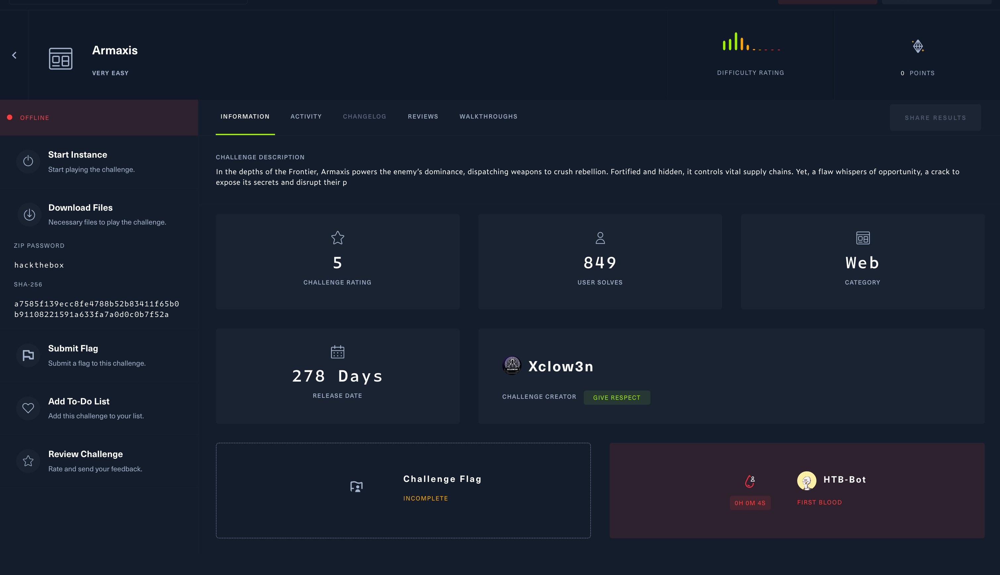
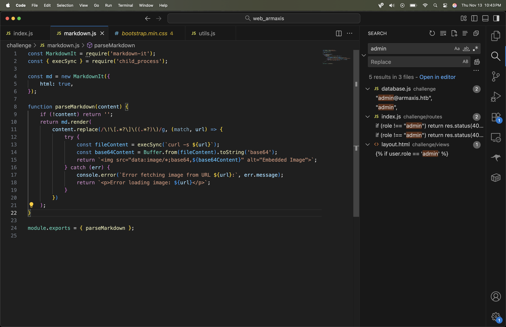
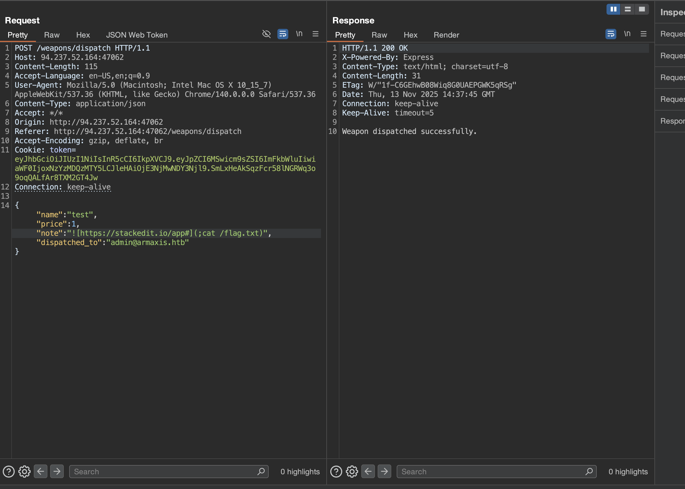
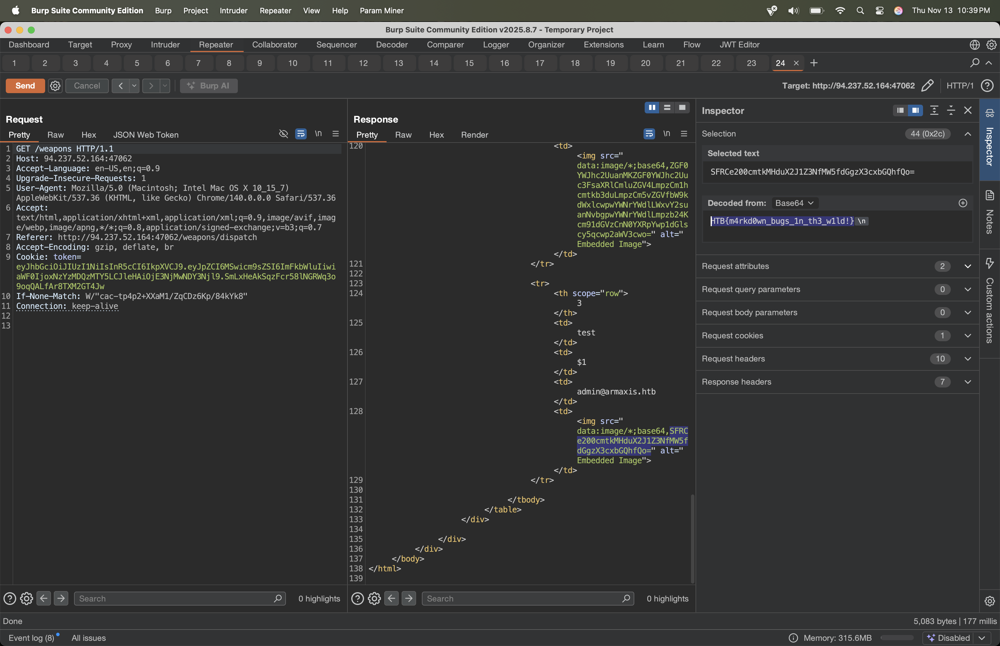

# Challenge Title: Armaxis

- Category: web
- Difficulty: VERY EASY
- Link: https://app.hackthebox.com/challenges/Armaxis

## 1. Challenge Description

In the depths of the Frontier, Armaxis powers the enemy’s dominance, dispatching weapons to crush rebellion. Fortified and hidden, it controls vital supply chains. Yet, a flaw whispers of opportunity, a crack to expose its secrets and disrupt their p



## 2. Vulnerability Summary

The challenge had two primary vulnerabilities:

1.  **Insecure Password Reset:** The password reset token was not tied to a specific user, allowing an attacker to reset the admin account's password.
2.  **Command Injection:** The application was vulnerable to command injection through the markdown rendering functionality, specifically in how it parsed URLs.

## 3. Solution

### 3.1. Exploitation

First, we exploited the insecure password reset mechanism to gain admin access.


With admin access, we could access features that use markdown rendering. We discovered a command injection vulnerability in the URL parsing logic.



We crafted a payload that reads the flag.txt.

```json
{"name":"test","price":1,"note":"","dispatched_to":"admin@armaxis.htb"}
```



This payload, when rendered, executes a command to read the flag file.

## 4. Flag



`HTB{m4rkd0wn_bugs_1n_th3_w1ld!}`

## 5. Tools Used

- `burp`