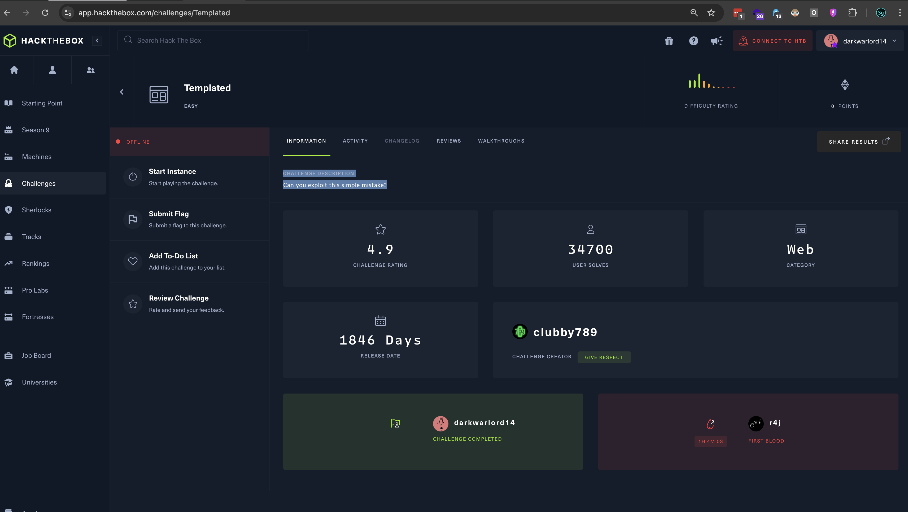
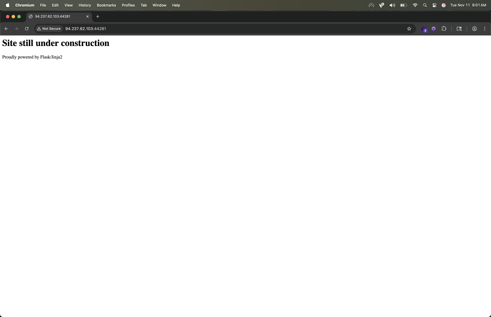
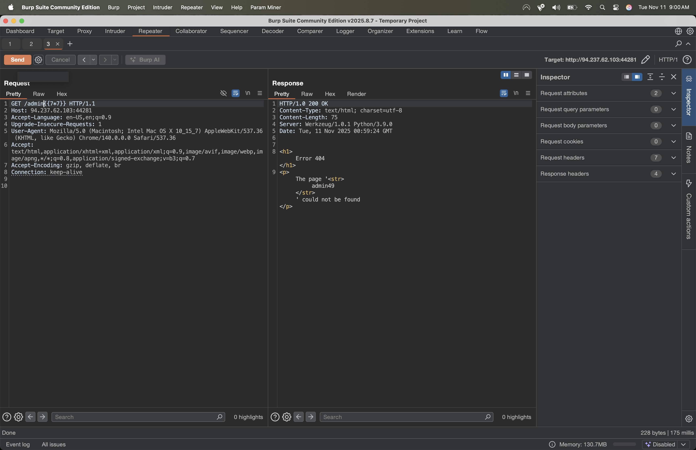
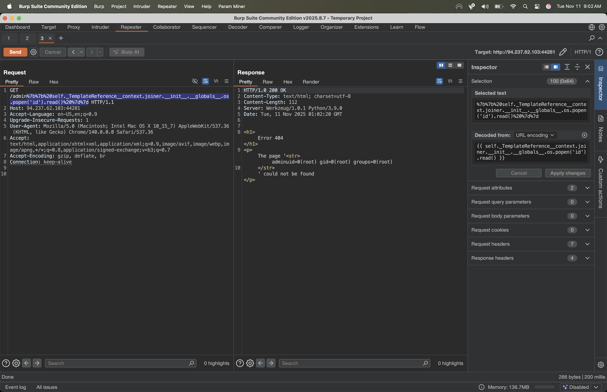
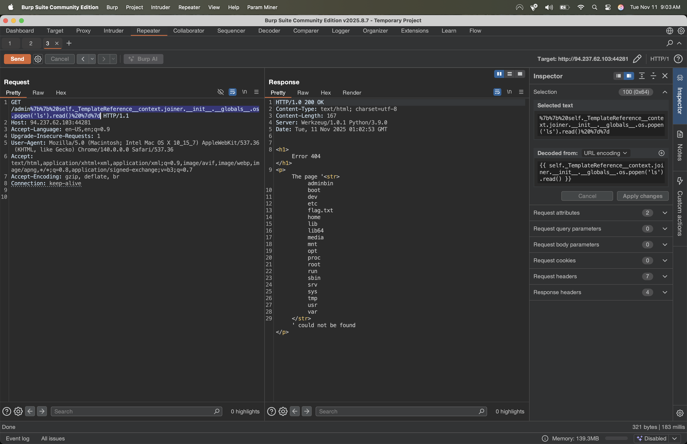
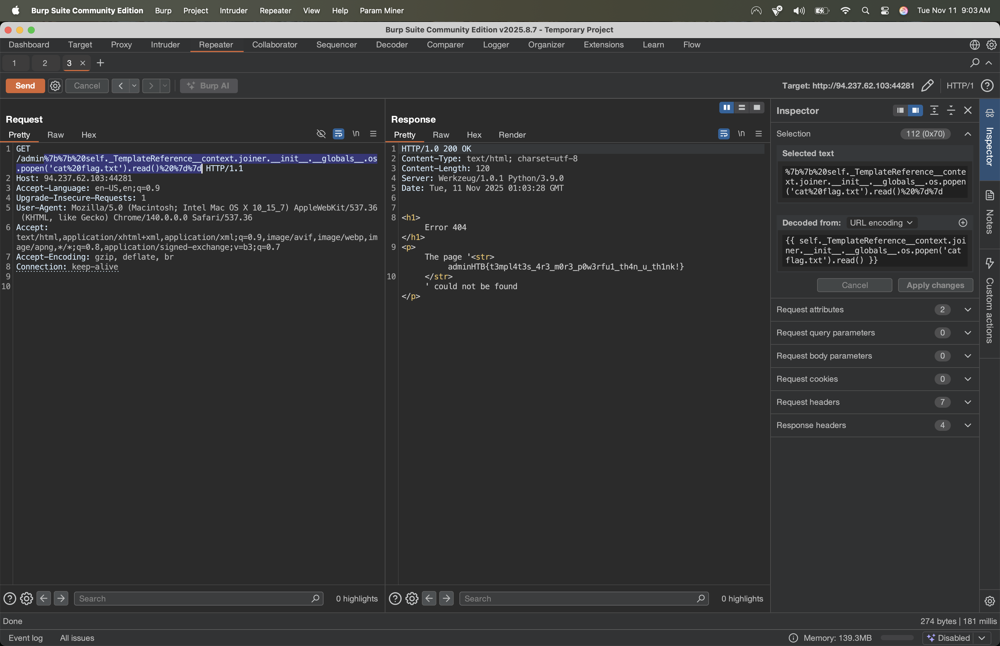

# Challenge Title: Templated

- Category: Web
- Difficulty: EASY
- Link: https://app.hackthebox.com/challenges/Templated

## Challenge Description

Can you exploit this simple mistake?

---

## 1. Vulnerability Summary

The application is vulnerable to Server-Side Template Injection (SSTI) due to improper handling of user-supplied input within a Jinja2 template. The initial reconnaissance revealed that the application is powered by Flask/Jinja2, strongly indicating an SSTI path.

## 2. Solution

### 2.1. Initial SSTI Detection

- **Payload:** `{{ 7*7 }}`
- **Expected Output:** `49`
- **Observation:** The application successfully processed the Jinja2 syntax, returning `49`, which confirmed the SSTI vulnerability.

### 2.2. Exploiting for Remote Code Execution (RCE)

## 3. Flag

- `adminHTB{t3mpl4t3s_4r3_m0r3_p0w3rfu1_th4n_u_th1nk!}`

## 4. Tools Used & References

### Tools Used

- `Burp Suite`
